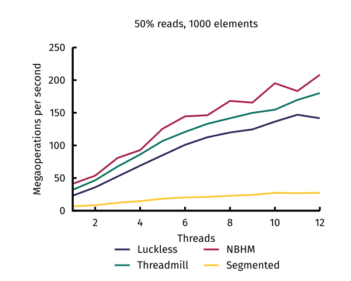

# A fast concurrent hash table.

*42nd At Threadmill* is a lock-free hash table based on Cliff
Click's NonBlockingHashMap, and Abseil's `flat_hash_map`. We use the
general layout of the former, and the fast metadata-based probing
trick of the latter.

See [A Fast Wait-Free Hash
Table](https://www.youtube.com/watch?v=WYXgtXWejRM) and [Matt
Kulukundis's "Designing a Fast, Efficient, Cache-friendly Hash Table,
Step by Step"
presentation](https://www.youtube.com/watch?v=ncHmEUmJZf4) for an
introduction to both tables.

We use SSE2 intrinsics for fast probing, and optionally use AVX2 for
faster byte broadcasting. This library requires a post-2.0.5 version of
SBCL, so that we can use some instructions introduced to the assembler
around then.

## Pictures of a benchmark

## Differences from Click's table

We replace copied values with a single `+copied+` marker instead of
an instance of a `Prime` class. This change generates less garbage
when copying, and leads to slightly faster barrier code; though our table
is not wait-free. (Truth be told, we're only barely getting a grip on Click's
resize logic now.) 

We also removed the <key, tombstone> state, having removes transition
back to <key, empty>; a superficial change which doesn't appear to affect
anything.

## Differences from Kulukundis's table

As Click requires us to pin keys to entries, we don't ever use tombstone
metadata. The metadata for a dead entry remains in the metadata table,
as we need to be able to find the right key entry to reuse quickly.

We have a somewhat improved load factor, but it is not as extreme as
Kulukundis's demonstration. Kulukundis could approach a load factor of
87.5%, but we find that 50% is the best tradeoff between space and
throughput with our table. However, we still have improved over
Click's table -- Click doubles the table size with 25% live keys, and
quadruples with 50% live, in order to "avoid endless
reprobing". Faster probing lets us get away with just doubling at 50%.

## Previous work

This concurrent hash table is based off the
[NonBlockingHashMap](https://github.com/boundary/high-scale-lib/blob/master/src/main/java/org/cliffc/high_scale_lib/NonBlockingHashMap.java),
and its Common Lisp port in
[Luckless](https://github.com/Shinmera/luckless). It is also based off the
[linear probing hash table implementation in SICL](https://github.com/robert-strandh/SICL/tree/master/Code/Hash-tables/Linear-probing),
as well as [its SIMD fork](https://github.com/no-defun-allowed/simd-sicl-hash-table).
